# plasticTravelPad

Plastic travel pad made from IKEA cutting boards.

# Pad Description

This pad comprises mechanical and electrical components, as well as software that runs on the microcontroller and PC.

## Mechanical Components

Since the purpose of this pad was to use IKEA products, most of the hardware consists of 5 processed IKEA LEGITIM cutting boards. The IKEA cutting boards are planed flat and cut to the appropriate size and shape using a miter saw. The pad is three levels high: The base level comprises two cut-down boards, the mid level consists of two vertically-running join pieces, and the top level comprises a two-part center panel and each of the four arrow panels.

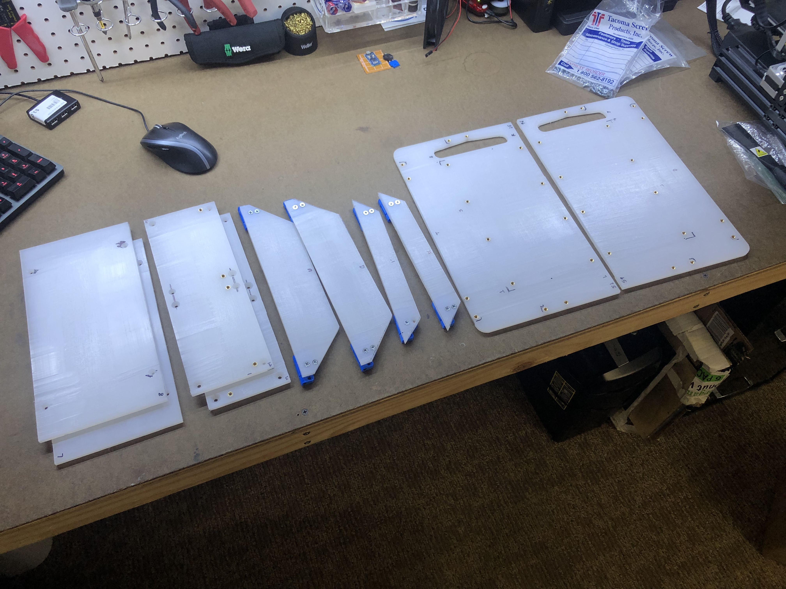

Each panel is connected to the base using a hinge. The hinges consist of a lower and an upper component that were 3D-printed out of PLA using 100% infill. The two hinge leafs are joined using a roll pin. The hinge bottom is secured to the base panel with two M4 flat-head screws, and the hinge top includes two M4 threaded holes by means of heat-set brass inserts.

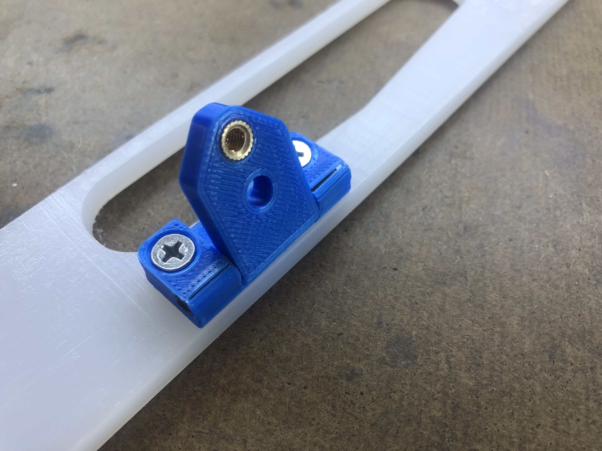

All the mechanical components are secured to each other using the aforementioned M4 flat-head screws and M4 heat-set inserts. This means that the entire pad requires no nuts to fasten the bolts.

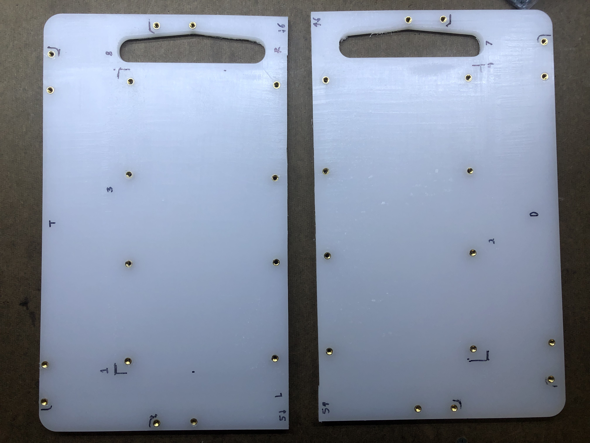

## Electrical Components

This pad doesn't (yet) feature a custom PCB, but instead an a simple Arduino Pro Micro with four fixed voltage divider resistors. The panel sensors are knockoff Intralink Force-Sensitive-Resistors (FSRs).

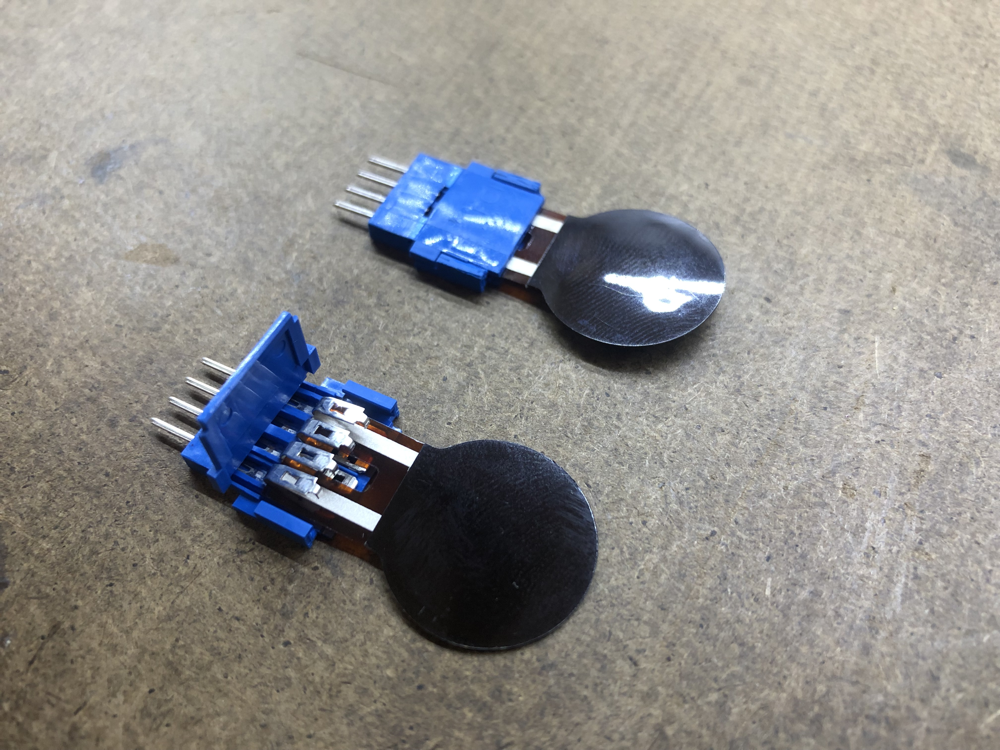

## Software

The pad uses [teejusb&#39;s outstanding FSR software](https://github.com/teejusb/fsr), which supports the PCB LEDs, several different microcontrollers, and includes a slick web interface for visualizing and adjust the FSR thresholds.

# Building Instructions

Here, I'll describe the steps that I followed to design and build this pad.

## Bill of Materials

This first table describes the components I mailordered specifically for this project and where I obtained them. **Note that I took advantage of Digikey's price breaks for higher order quantities and this table does not reflect these costs at single-quantity**

| Category    | Part              | Vendor     | Vendor Part#       | Detail                      | Quantity | Cost/Ea [USD] |
| ----------- | ----------------- | ---------- | ------------------ | --------------------------- | -------- | ------------- |
| Pad Frame   |                   | IKEA       | LEGITIM 902.022.68 |                             | 5        | 3.99          |
| Pad Frame   | Base              |            |                    | Base pieces                 | 2        |               |
| Pad Frame   | Mid               |            |                    | Joining pieces              | 2        |               |
| Pad Frame   | Top               |            |                    | Center panel                | 2        |               |
| Pad Frame   | Up/Down Panel     |            |                    | 2.5" width                  | 2        |               |
| Pad Frame   | Left/Right Panel  |            |                    | 1.25" width                 | 2        |               |
| Hinge       | Hinge Lower       | 3D Printed |                    | PLA, 100% infill            | 8        | 0.0364        |
| Hinge       | Hinge Upper       | 3D Printed |                    | PLA, 100% infill            | 8        | 0.0428        |
| Hinge       | Roll Pin          | Local      |                    | 5/32" Diameter, 1.5" length | 8        | 0.2577        |
| Pad Sensor  | FSR               | Ebay       | N/A                | Knockoff Intralink          | 4        | 1.695         |
| Pad Sensor  | FSR Connector     | Digikey    | 609-2178-ND        | Amphenol 66226-004LF        | 8        | 0.92          |
| General     | Flathead Screw    | Local      |                    | M4-0.7 x 10mm               | 56       | 0.07          |
| General     | Heat-Set Insert   | Amazon     | Keadic             | M4 x 6mm x 6mm              | 56       | 0.1           |
| Electronics | Arduino Pro Micro | Various    |                    | 5V Pro Micro, ATMega32u4    | 1        | 5.00          |

In addition, you'll want the following components. I had these laying around already or got them separately. Different people may be able to source these at different costs so I've removed the "cost" column here.

| Category         | Part              | Suggested Vendor           | Detail                                              | Quantity     |
| ---------------- | ----------------- | -------------------------- | --------------------------------------------------- | ------------ |
| Pad Sensor       | Wire              | Local electronics supplier | Various colors are helpful. I used 22 AWG           | Several feet |
| Pad Sensor       | Resistor          | Online supplier            | Depending on preference, commonly-used is 330-1kOhm | 4            |
| Pad Sensor       | Double-Sided Tape | Local supplier             | I used standard Scotch                              |              |
| Modding          | Gorilla Tape      | Local supplier             | Replace with your preferred mod tape                |              |
| Cable Management | Zip Tie mounts    | Local supplier             | I used these to hold the wires down                 |              |
| Communication    | Micro USB cable   | Local supplier             | Connects directly to the Pro Micro                  |              |

In addition, I'd recommend the following tools. Several of these I bought for other projects and several I borrowed from my local tool-share.

| Tool                             | Purpose(s)                                                   |
| -------------------------------- | ------------------------------------------------------------ |
| Power drill / Drill Press + Bits | Drill-out clearance holds for panels and layers + 3D inserts |
| Planer                           | Plane cutting boards flat                                    |
| Miter saw                        | Cut pad frame and panels                                     |
| Soldering iron                   | Solder through-hole components, set inserts                  |
| Threadlocker                     | Secure fasteners                                             |
| Screwdriver                      | Assemble layers and panels                                   |
| Heat-shrink tubing               | Secure FSR connectors                                        |
| Wire stripper                    | Prepare FSR wire                                             |
| Pliers                           | Secure FSR connectors                                        |

## Build Guidelines

### Hardware Components

1. Plane all cutting boards down to approximately 7mm thick. For me, this was a very messy process and I found it very hard to get a perfectly consistent thickness.
2. Cut all the pad components to size using a miter saw. I found that HDPE cuts quite nicely as it's quite soft. Make sure to mark out the panels and clamp each piece appropriately.
3. Measure, mark and drill the holes in each of the pad frame layers. I'd recommend drilling the clearance holes on the second layer first, then match-drilling the base layer to get the arrangement correct. Then, repeat the process for the top panels. Use a countersink bit to get the screw heads flush or sub-flush with the surface. I found the HDPE soft enough to do this by hand.
   1. The bottom layer comprises entirely straight holes for the heat-set inserts
   2. The middle layer comprises a combination of the straight holes and countersunk clearance holes for securing to the bottom layer
   3. The top layer comprises entirely countersunk holes for securing to the middle layer.
4. Measure, mark and drill the holes in each of the panels. Countersink the holes as before.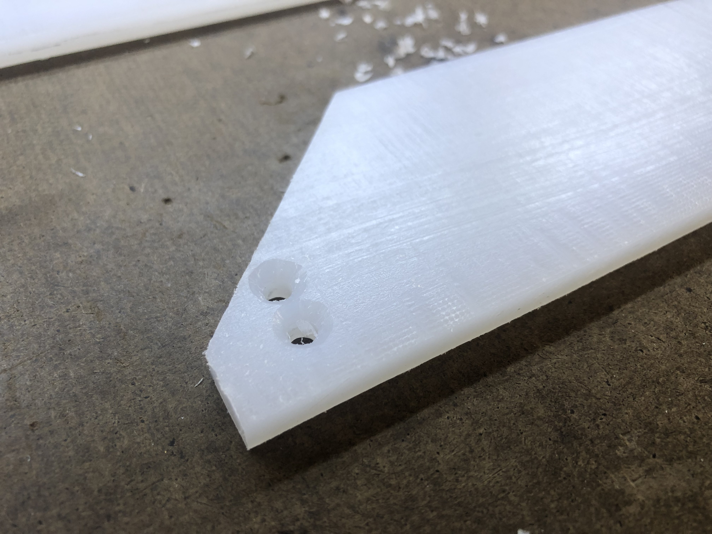
5. Print out the hinge components. I attempted to print all 16 (8 top, 8 bottom leaves) in one go but ran into warping issues on about half, so I printed those in another run. I used a Voxelab Aquila printer, PLA filament, and 100% infill. Assemble the hinges by pressing the roll pins across.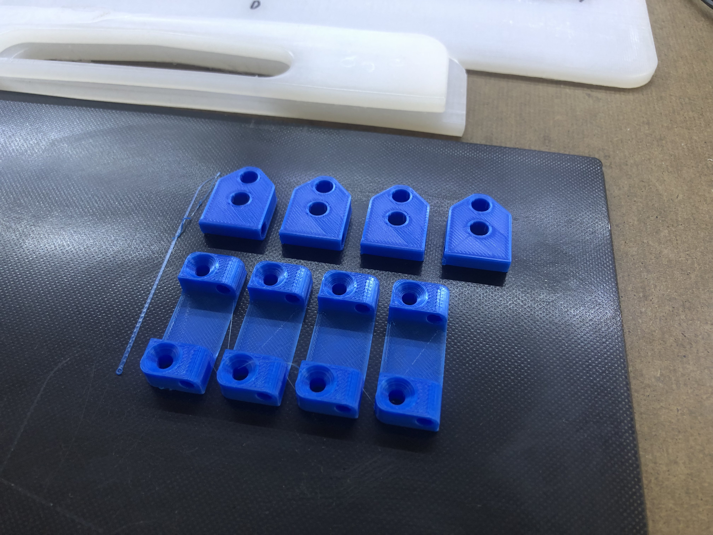
6. Assemble the second layer on the base layer and secure in-place using flat-head screws. 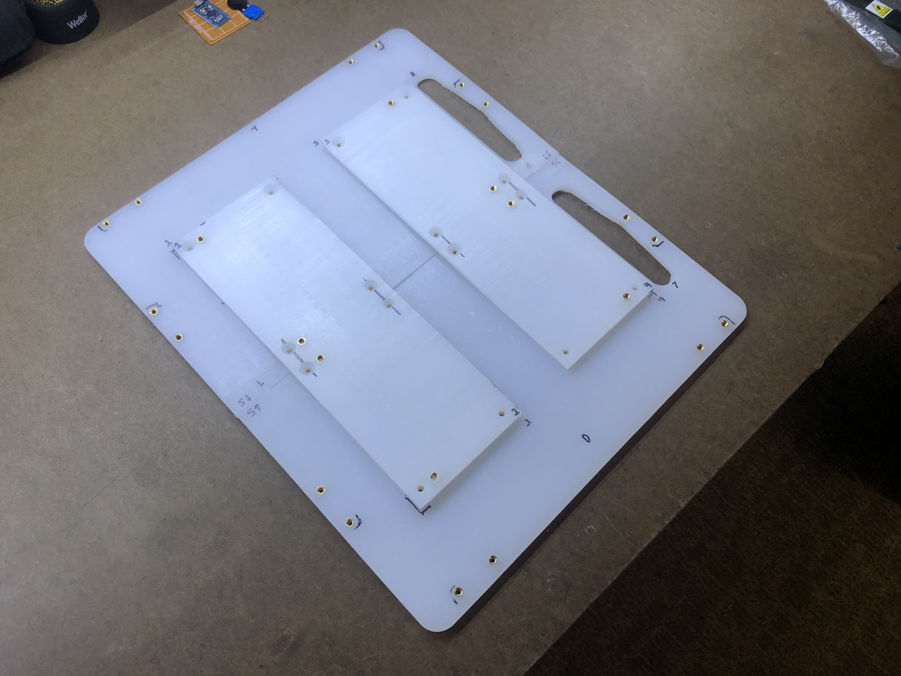
7. Assemble the top layer on the second layer and secure in-place using flat-head screws. 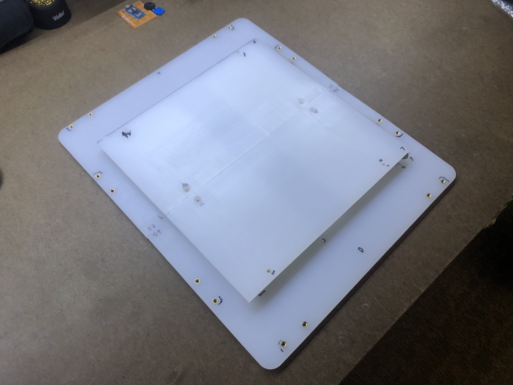
8. Install the panel assemblies. You may find it easier to match-drill these too (it's what I did!)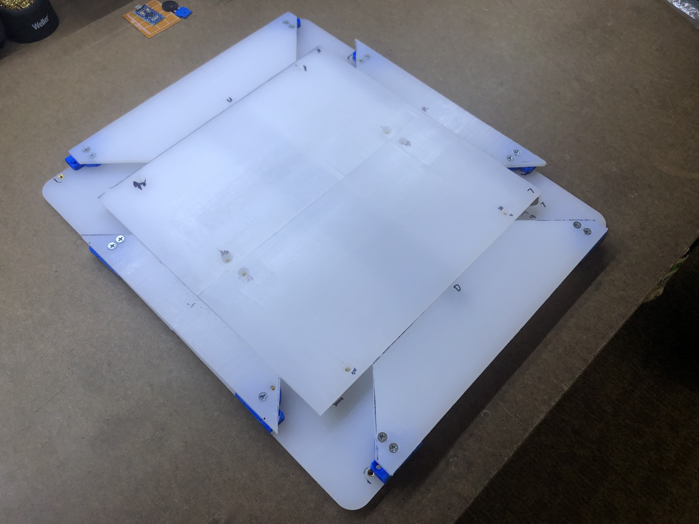

### Electronic Components

You can use a custom PCB to drive this pad's electronics, but as I haven't finished the design for such as PCB yet, I'm currently using an extremely simple Pro Micro setup on this pad.

1. Secure the FSRs to the base panel and mod to preference. I prefer to put the FSRs on a base of Gorilla tape and then stack up tape on the underside of the panel to adjust the height. Run wires back from the connectors to the microcontroller. I located my Pro Micro in the upper-left corner, but you could conceivably fit it under a panel or in the center gap. I ran the down FSR wires through this gap, but you could also run them under one of the side panels. I used a few zip tie mounts to hold the wires down. 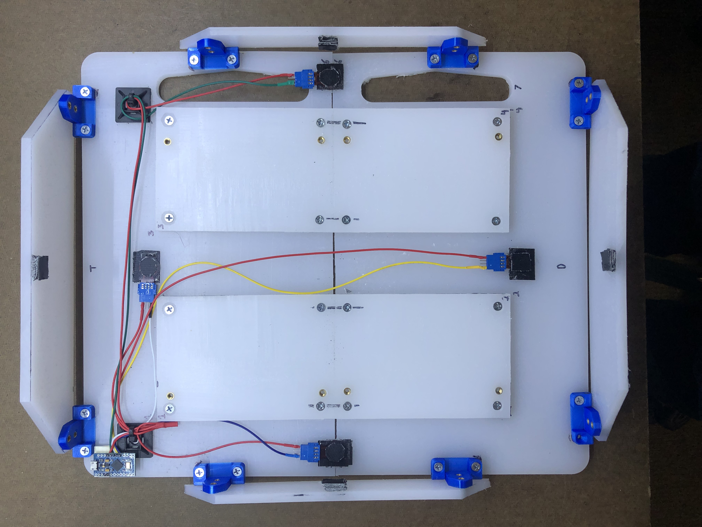
2. Prepare the microcontroller. For this project, I just made a single VCC node and soldered the voltage divider fixed resistors to ground (I used 1kOhm) 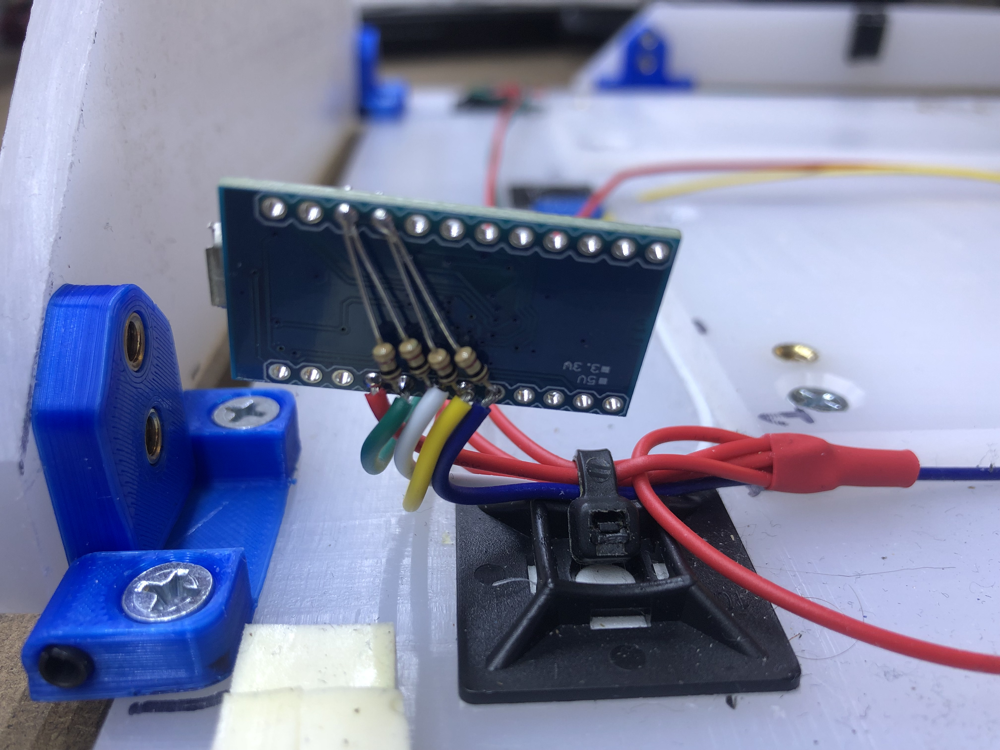
3. I'd also recommend securing the microcontroller to the pad, I used double-sided tape but this isn't a great long-term solution.

## Software Instructions

As I didn't write any of the code, I'll point you to [teejusb&#39;s FSR software](https://github.com/teejusb/fsr).

